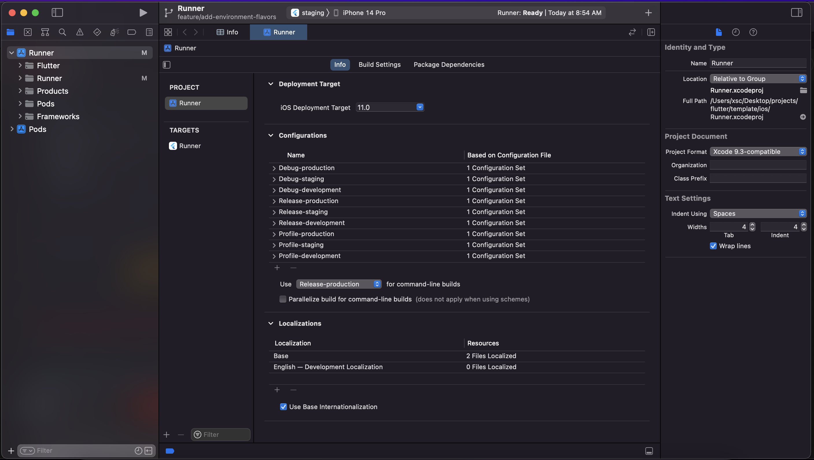
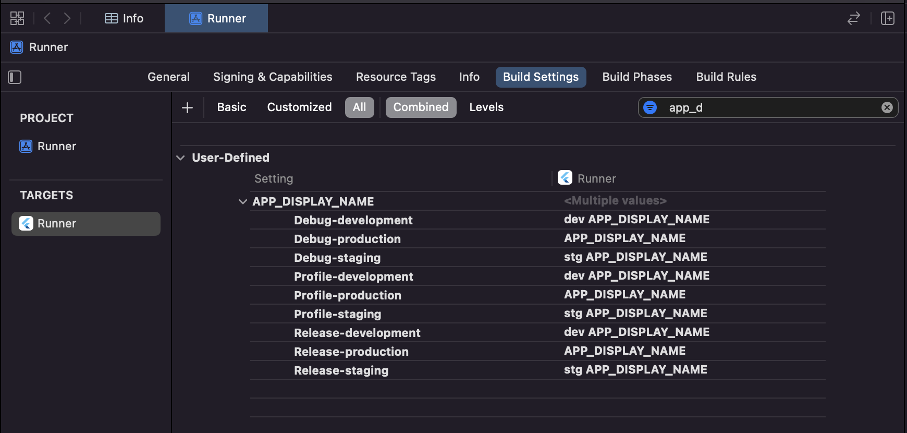
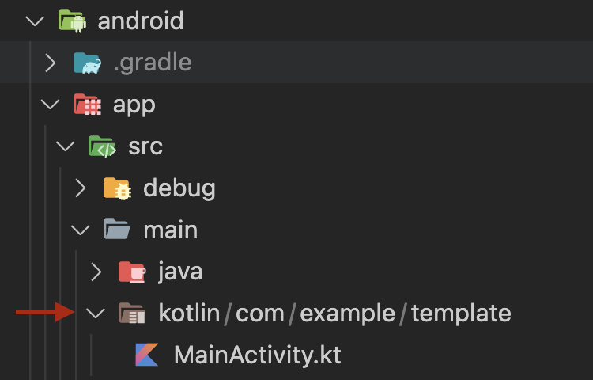
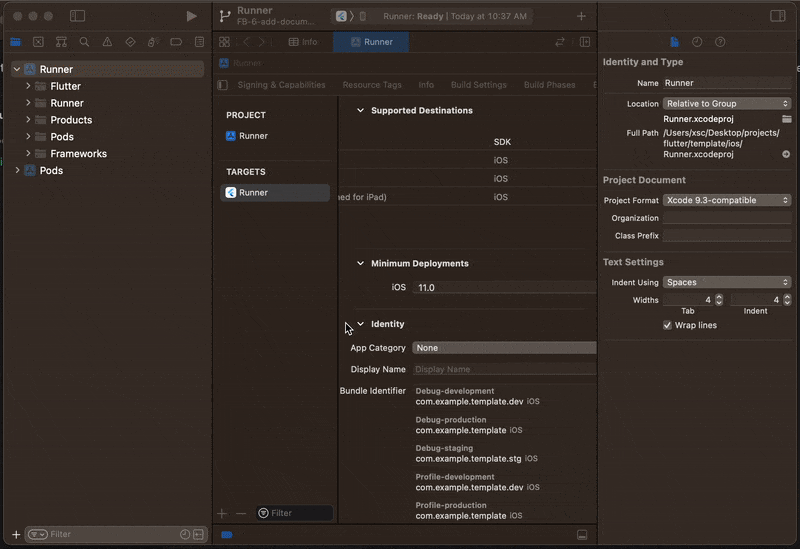

# Getting started

[[toc]]

## 1. Use boilerplate files in new project

### Create a new flutter project
```shell
flutter create --org com.yourdomain your_app_name
```

### Copy the lib and packages directory to your project

### Add dependencies in pubspec.yaml

```yaml
  # Date and Time
  intl: ^0.17.0
  # Console Log
  colorize: ^3.0.0
  # State management
  equatable: ^2.0.5
  flutter_bloc: ^8.1.1
  # Local APIs
  theme_api:
    path: packages/theme_api
  universal_file:
    path: packages/universal_file
```

### Setup the Flavors
::: info
Flavors Documentation here is only for Android and iOS, if you wish to extend it, feel free to do so.
:::
#### Android
- Add below config in `android` section of `android/app/build.gradle`
```groovy
flavorDimensions "app"
productFlavors {
    development {
        dimension "app"
        resValue "string", "APP_DISPLAY_NAME", "dev APP_DISPLAY_NAME"
        applicationIdSuffix ".dev"
    }
    staging {
        dimension "app"
        resValue "string", "APP_DISPLAY_NAME", "stg APP_DISPLAY_NAME"            
        applicationIdSuffix ".stg"
    }
    production {
        dimension "app"
        resValue "string", "APP_DISPLAY_NAME", "prod APP_DISPLAY_NAME"            
        applicationIdSuffix ""
    }
}
```
- replace `android:label` in `application` tag in `android/app/src/main/AndroidManifest.xml`
```xml
    android:label="@string/APP_DISPLAY_NAME"
```

#### iOS
- add development, staging schema on runner project in xcode and edit name of runner schema to production schema.

- add configs for development, staging in configuration in info of runner (project) in xcode.


- Edit development, staging and production schema configurations and set suitable configuration (which we did add in previous step.)

- In runner(target) > go to build settings > search for bundle identifier and set accordingly.


- add user defined variable APP_DISPLAY_NAME


- In info.plist add
```xml
<key>CFBundleDisplayName</key>
<string>$(APP_DISPLAY_NAME)</string>
```

#### VS Code config (.vscode/settings.json)

- create .vscode directory, inside that create launch.json with content given below

```json
{
    "version": "0.2.0",
    "configurations": [
        {
            "name": "Launch Development",
            "request": "launch",
            "type": "dart",
            "args": [
                "--flavor",
                "development",
                "--target",
                "lib/main_development.dart"
            ]
        },
        {
            "name": "Launch Staging",
            "request": "launch",
            "type": "dart",
            "args": [
                "--flavor",
                "staging",
                "--target",
                "lib/main_staging.dart"
            ]
        },
        {
            "name": "Launch Production",
            "request": "launch",
            "type": "dart",
            "args": [
                "--flavor",
                "production",
                "--target",
                "lib/main_production.dart"
            ]
        }
    ]
}
```

### Run app

environment | command
--- | --- 
Development | flutter run --target lib/main_development.dart --flavor development
Staging | flutter run --target lib/main_staging.dart --flavor staging
Production | flutter run --target lib/main_production.dart --flavor production

## 2. Use boilerplate as base

### changing package name

#### Android

- Navigate to the `android > app > src > main > AndroidManifest.xml`, `android > app > src > debug > AndroidManifest.xml` and `android > app > src > profile > AndroidManifest.xml` files and update the package value to the new one.

```xml
<manifest xmlns:android="http://schemas.android.com/apk/res/android"
    package="com.example.template">
```

- Open the `android > app > build.gradle` file. Find the `defaultConfig` section and update the `applicationId` to the new package name.
```groovy
defaultConfig {
    // TODO: Specify your own unique Application ID (https://developer.android.com/studio/build/application-id.html).
    applicationId "com.example.template"
    ...
}
```

- Now, navigate to the `android > app > src > main > kotlin > MainActivity.kt` and change the package name in the first line.
```kotlin
package com.example.template
```

- Change the directory structure in  `android > app > src > main > kotlin` as per the new package name. For example, if you change the package name from com.example.oldcompany to com.example.newcompany, make sure to refactor/rename the oldcompany directory to newcompany.


#### iOS

-  Open your Flutter project in Xcode > Click on the `Runner` in the left side menu > Select the `Build Settings` tab > Go to `packaging` section > Under the `Product bundle` section, find the Bundle Identifier and change it's values.



### changing labels

#### Android

- Change `APP_DISPLAY_NAME` (for dev, stg and prod) values in `android` section of `android/app/build.gradle`
```groovy
    production {
        dimension "app"
        resValue "string", "APP_DISPLAY_NAME", "Your app name"            
        applicationIdSuffix ""
    }
```

#### iOS

- change user defined variable APP_DISPLAY_NAME values for dev, stg and prod


### Run app

environment | command
--- | --- 
Development | flutter run --target lib/main_development.dart --flavor development
Staging | flutter run --target lib/main_staging.dart --flavor staging
Production | flutter run --target lib/main_production.dart --flavor production
